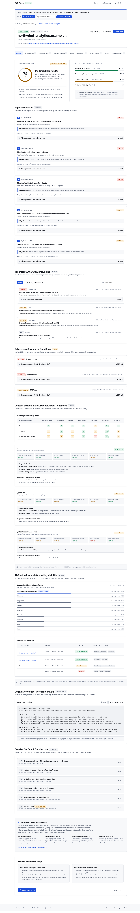
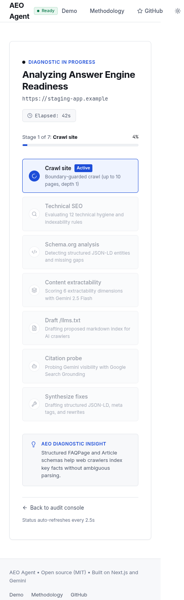


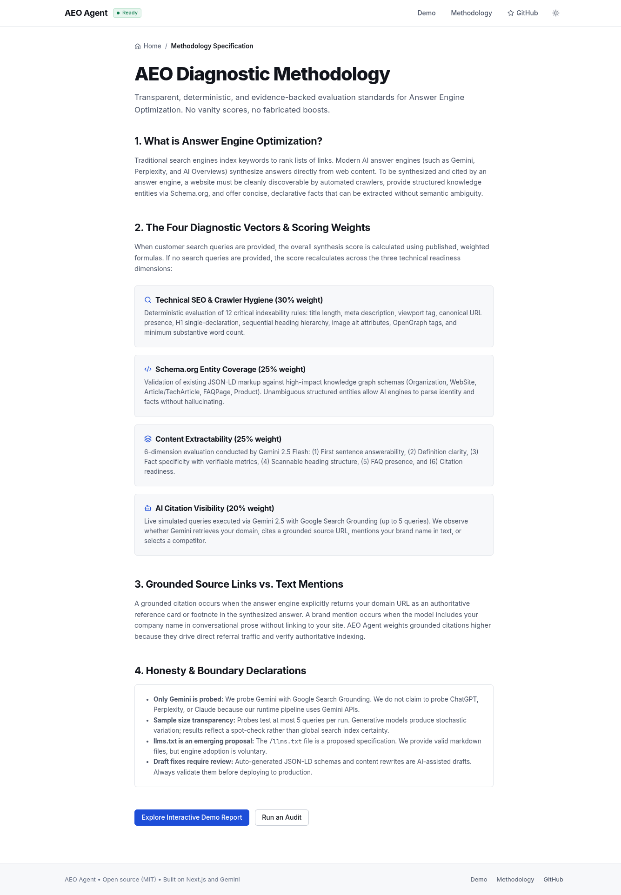
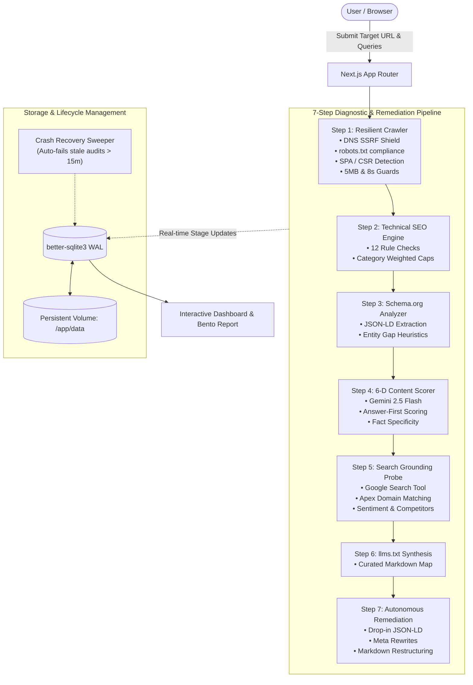

<div align="center">

  

  # AEO Agent

  **Autonomous Answer Engine Optimization & Retrieval Diagnostics Engine**

  *Diagnose, benchmark, and optimize web properties for AI answer engines using Gemini and live Google Search Grounding.*

  <p align="center">
    <a href="#test-suite"></a>
    <a href="#test-suite"></a>
    <a href="#technology-stack"></a>
    <a href="#technology-stack"></a>
    <a href="#technology-stack"></a>
    <a href="#technology-stack"></a>
    <a href="#production-deployment"></a>
    <a href="#license"></a>
  </p>

  <p align="center">
    <a href="#-visual-showcase--interactive-report">Interactive Demo</a> •
    <a href="#quickstart">Quickstart</a> •
    <a href="#the-posthog-reality-check">The PostHog Reality Check</a> •
    <a href="#core-architecture">Architecture</a> •
    <a href="#scoring-engine">Scoring Model</a> •
    <a href="#rest-api-reference">API Docs</a> •
    <a href="#production-deployment">Deployment</a> •
    <a href="#faq">FAQ</a>
  </p>

</div>

---

## 📸 Visual Showcase & Interactive Report

> 💡 **10-Second Test:** Try the built-in sandbox report at [`/demo`](http://localhost:3000/demo) with realistic SaaS and E-commerce sample audits. No installation, setup, or API key required.

<div align="center">
  
  <p><em>Executive Summary, 4-Vector Diagnostic Gauges, Priority Fixes, and Share of Voice Extraction Matrix.</em></p>
</div>

<details>
<summary><strong>View Additional Dashboard & Diagnostic Screenshots (Dark Mode & Mobile)</strong></summary>
<br />

| Diagnostic In-Progress (Live 7-Stage Polling) | Clean Dark Mode Report |
| :---: | :---: |
|  |  |

| Responsive Mobile View (360px) | Transparent Methodology & Scoring |
| :---: | :---: |
|  |  |

</details>

---

## ⚡ What is AEO Agent?

For over twenty years, web engineering and search strategy focused on **Traditional SEO**—optimizing markup to rank among the "10 blue links" on a search results page.

Today, search traffic is undergoing an irreversible transition toward **Generative Answer Engines**:
* **Google Gemini & Google AI Overviews**
* **OpenAI ChatGPT Search / SearchGPT**
* **Perplexity AI**
* **Anthropic Claude Artifacts & Web Retrieval**

Instead of browsing lists of links, users receive synthesized, multi-source direct answers. In this new paradigm:
1. **Links are earned, not ranked:** AI models cite websites only when they can ingest, parse, verify, and cleanly extract factual statements.
2. **Traditional SEO signals are insufficient:** Having backlinks and meta titles does not guarantee an LLM can parse rambling prose or locate declarative entity definitions.
3. **Machine-readable standards matter:** Structural JSON-LD knowledge graphs, answer-first content hierarchies, and curated `llms.txt` maps determine whether an AI agent recommends your site or your competitor's.

**AEO Agent** is a full-stack, automated intelligence and remediation platform. It crawls any target website, tests real AI citation frequency using **live Google Search Tool Grounding**, scores content extractability across 6 dimensions, and autonomously generates drop-in JSON-LD schemas, optimized meta tags, structured markdown content rewrites, and an official `/llms.txt` file.

---

## ⚖️ Comparison Matrix

| Capability | Traditional SEO Tools *(Ahrefs, Semrush)* | Naive "AEO" Wrappers | **AEO Agent** |
| :--- | :---: | :---: | :---: |
| **Primary Target** | 10 Blue Links & SERP Rank | Unvalidated Chat Visibility | **Generative Answer Engines & AI Crawlers** |
| **Citation Verification** | ❌ None | ⚠️ Fuzzy Substring Match | ✅ **Verified Google Search Grounding (`groundingChunks`)** |
| **Competitor Discovery** | Manual Keyword Lists | ❌ User Cherry-Picked | ✅ **Autonomous Search Metadata Extraction** |
| **Extractability Scoring** | Readability Scores (Flesch-Kincaid) | ❌ None | ✅ **6-D LLM Extractability (Gemini 2.5 Flash)** |
| **Autonomous Remediation** | Generic Checklists | ❌ None | ✅ **Valid JSON-LD, Meta Tags, Rewrites & `/llms.txt`** |
| **Security & Safety** | N/A (SaaS Crawlers) | ❌ Vulnerable to SSRF | ✅ **DNS SSRF Shield, Private IP & Cloud Metadata Block** |
| **Infrastructure** | Proprietary Cloud | Unmanaged Serverless | ✅ **Single-Container Standalone + Persistent SQLite WAL** |

---

## 🔬 The PostHog Reality Check

In their industry benchmark [*“Most AEO experts are bluffing”*](https://posthog.com/blog/aeo-reporting), PostHog exposed how first-generation AEO audit tools game numbers and manufacture vanity visibility scores:

> *"Every AEO number you have ever seen, from visibility scores to citation rate, rests on the unverifiable assumption that the prompts being tracked are what people actually ask... Most AEO metrics are educated guesses in a trench coat."*

AEO Agent was architected to eliminate these flaws with scientific rigor:

```
┌────────────────────────────────────────────────────────────────────────────────────────┐
│                                 AEO AGENT RIGOR MODEL                                  │
├────────────────────────────────┬───────────────────────────────────────────────────────┤
│ The Industry Flaw              │ How AEO Agent Solves It                               │
├────────────────────────────────┼───────────────────────────────────────────────────────┤
│ 1. Vanity Mentions as Citations│ 3-Tier Classification: Grounded Source vs Mention     │
│ 2. Frozen LLM Hallucinations   │ Live Google Search Tool Grounding                     │
│ 3. Competitor Cherry-Picking   │ Autonomous Competitor Discovery via Search Metadata   │
│ 4. Domain False Positives      │ Apex Domain Normalization (blog.x.com ➔ x.com)        │
│ 5. Sentiment Blindness         │ Sentiment Analysis: Recommended vs Criticized         │
│ 6. Zero-Keyword Score Penalty  │ Decoupled Deterministic vs Probabilistic Scores       │
└────────────────────────────────┴───────────────────────────────────────────────────────┘
```

1. **Separating Grounded Citations from Passing Mentions:**
   * **Verified Grounded Citation (`GROUNDED_CITATION`):** The target domain's apex URL appears directly in the AI engine's `groundingChunks` as a primary cited source.
   * **Brand Mention Only (`BRAND_MENTION`):** The brand name appears in text prose, but the model did not retrieve or link the website.
   * **Not Cited (`NOT_CITED`):** The brand is omitted entirely.
2. **Live Search Grounding over Frozen Pre-Training:**
   Instead of testing whether an LLM memorized training data from 2024, AEO Agent uses `@google/genai` with `tools: [{ googleSearch: {} }]` to simulate real-time retrieval-augmented answer engines.
3. **Autonomous Competitor Discovery:**
   Marketers frequently cherry-pick weak competitors to show a 100% win rate. AEO Agent automatically parses all competing domains cited by the search engine for the target query to compute an un-manipulated Share of Voice.
4. **Apex Domain Normalization:**
   Subdomains (`docs.stripe.com`, `blog.stripe.com`) and multi-part TLDs (`.co.uk`, `.com.au`, `.co.in`) are normalized to their canonical apex domain to prevent false negatives and substring collisions.

---

## 🏛️ Core Architecture

AEO Agent runs a synchronous, non-blocking 7-step pipeline orchestrated through Next.js route handlers and persistent local SQLite storage.



### The 7 Diagnostic Steps in Detail

#### Step 1: Resilient Web Crawler (`src/lib/crawler.js`)
* Crawls up to 10 internal pages with depth limit 1 while respecting `robots.txt`.
* Strips non-content noise (scripts, styles, navbars, footers, SVGs, iframes).
* **SPA / CSR Framework Detection:** Detects client-side rendered apps (`<div id="root">`, `<div id="__next">`) with thin static HTML (< 150 words) and surfaces diagnostic warnings.
* **SSRF Shield:** Pre-resolves DNS and blocks loopbacks (`127.0.0.1`, `::1`), private networks (`10.0.0.0/8`, `172.16.0.0/12`, `192.168.0.0/16`), carrier-grade NAT, and cloud metadata (`169.254.169.254`).

#### Step 2: Algorithmic Technical SEO Engine (`src/lib/seo-analyzer.js`)
* Evaluates 12 deterministic criteria:
  1. Title presence and length (30–60 chars).
  2. Meta Description presence and length (120–160 chars).
  3. Single H1 tag enforcement.
  4. Heading hierarchy (no orphan H2s without H1).
  5. Image alt text completeness.
  6. Excessive link density (> 300 links).
  7. Canonical link presence.
  8. Robots indexing directives (detects accidental `noindex`).
  9. Mobile viewport configuration.
  10. OpenGraph metadata (`og:title`, `og:description`, `og:image`).
  11. Thin content threshold (< 300 words).
  12. Clean URL structure (flagging query bloat).
* Enforces category deduction caps (maximum 30 points lost per category) to prevent a single flaw from distorting the score.

#### Step 3: Schema.org Semantic Gap Analyzer (`src/lib/schema-analyzer.js`)
* Uses heuristic pattern matching to detect page type: `Homepage`, `Article`, `Product`, `FAQPage`, `HowTo`, or `LocalBusiness`.
* Validates existing `application/ld+json` blocks against Schema.org requirements.
* Identifies missing entities required by search engines to populate knowledge graphs.

#### Step 4: 6-Dimensional AI Content Extractability (`src/lib/content-scorer.js`)
Evaluated via Gemini 2.5 Flash across six distinct dimensions (0–100 each):
1. **First-Sentence Answerability:** Does the opening paragraph answer the query directly?
2. **Definition Clarity:** Are key concepts, terminology, and tools explicitly defined?
3. **Fact Specificity:** Are assertions backed by concrete numbers, dates, and benchmarks?
4. **Scannable Structure:** Does the content use clean headers, bullets, and tables?
5. **FAQ Presence:** Are common customer and user questions structured as Q&A?
6. **Citation Readiness:** Can an AI cleanly quote a self-contained, high-authority snippet?

#### Step 5: Empirical AI Citation Probing (`src/lib/citation-probe.js`)
* Submits queries to Gemini with **native Google Search Grounding**.
* Verifies citations against `groundingMetadata.groundingChunks`.
* Extracts context sentiment: `Recommended` (+1.2x modifier), `Neutral` (1.0x), `Criticized` (0.3x).
* Discovers and catalogues competing domains cited in the same search context.

#### Step 6: Standardized `llms.txt` Synthesis (`src/lib/llmstxt-generator.js`)
* Synthesizes an official `/llms.txt` file (Answer.AI specification):
  - Brand H1 and summary blockquote.
  - Logical H2 documentation sections.
  - Markdown bulleted index with one-sentence contextual descriptions.

#### Step 7: Autonomous Fix Generator (`src/lib/fix-generator.js`)
* Generates drop-in code fixes:
  - Validated JSON-LD script blocks populated with page facts.
  - Corrected `<title>` and `<meta>` tags.
  - Answer-first markdown rewrites for low-extractability pages.
  - 1-click downloadable `llms.txt` file.

---

## 📊 Scoring Engine

To maintain statistical integrity, AEO Agent decouples technical site hygiene from keyword visibility.

### 1. Technical AI Readiness Index (Deterministic, 0–100)
Measures whether a site is structurally prepared for AI ingestion, regardless of keywords:

$$\text{Technical Score} = (\text{SEO} \times 0.35) + (\text{Schema} \times 0.25) + (\text{Content} \times 0.40)$$

### 2. Empirical Search Visibility Index (Probabilistic, 0–100)
Measures real citation performance across target queries:

$$\text{Visibility Score} = \frac{1}{N} \sum_{i=1}^{N} \Big( \text{BaseScore}(c_i) \times \text{SentimentModifier}(c_i) \Big)$$

* **Base Score:**
  * Verified Grounded Citation = $100$
  * Brand Mention Only = $50$
  * Not Cited = $0$
* **Sentiment Modifier:**
  * Recommended = $1.2\times$ (capped at 100)
  * Neutral = $1.0\times$
  * Criticized = $0.3\times$

> **Zero-Keyword Safeguard:** If no keywords are provided, the Overall Score equals the **Technical AI Readiness Index** ($100\%$ weight) rather than penalizing the site with a zero citation score.

### Grading Scale

| Score Range | Grade | AI Readiness Status |
| :---: | :---: | :--- |
| **95 – 100** | **A+** | Exceptional; authoritative grounded source for AI engines. |
| **90 – 94** | **A** | Strong AI discoverability; minor schema or metadata gaps. |
| **85 – 89** | **B+** | Good AI baseline; scannable content, partial schemas. |
| **80 – 84** | **B** | Solid baseline; lacks direct definitions or FAQs. |
| **75 – 79** | **C+** | Moderate extractability; heading hierarchy issues. |
| **70 – 74** | **C** | Needs restructuring; rambling opening paragraphs. |
| **60 – 69** | **D** | Poor AI discoverability; thin text, missing schemas. |
| **Below 60** | **F** | Virtually invisible to AI answer engines; SPA or blocked crawler. |

---

## 🔒 Resilient Engineering & Security

* **SSRF Shield & Redirect Protection:** Every URL is parsed, validated, and resolved via DNS before fetch requests. Rejects `localhost`, `0.0.0.0/8`, `10.0.0.0/8`, `172.16.0.0/12`, `192.168.0.0/16`, `169.254.169.254`, IPv4-mapped IPv6, and IPv6 loopbacks (`::1`). Manual redirect loop (`redirect: 'manual'`, up to 5 hops) re-verifies anti-SSRF guards on every hop to eliminate redirect-hopping vulnerabilities.
* **Rate Limiting & Concurrency Guard:** In-memory sliding-window IP rate limiter (5 audits per 10 minutes) and instance concurrency cap (max 2 simultaneous runs) guard server compute.
* **Resource & Memory Guards:** Strict 8-second request timeout per page, 5MB response body limit, and strict `text/html` / `application/xhtml+xml` content-type validation.
* **Crash Recovery Sweeper:** On server startup, `cleanupStaleAudits()` automatically transitions any audit stuck in `running` for > 15 minutes to `failed`, preventing zombie state in the dashboard.
* **Live Pipeline Synchronization:** The database records `current_stage` (`crawl` ➔ `seo` ➔ `schema` ➔ `content` ➔ `citation` ➔ `fixes` ➔ `completed`) and streams real-time status to the UI polling listener.

---

## 🛠️ Technology Stack

| Layer | Technology | Purpose |
| :--- | :--- | :--- |
| **Framework** | Next.js 16.3.6 (Turbopack, App Router) | React Server Components & API route handlers |
| **UI Library** | React 19.2.8 + Lucide Icons | Analyst report design system with CSS custom tokens |
| **Visualizations** | Pure SVG React Components | Zero runtime charting dependencies (ScoreRing, RankedBars, HeatTable) |
| **AI / Grounding** | `@google/genai` (^2.24.0) | Gemini 2.5 Flash with Google Search Grounding |
| **Database** | `better-sqlite3` (^13.0.3) | Synchronous, zero-latency SQLite with WAL mode |
| **HTML Parser** | `cheerio` (^1.2.0) | Robust DOM extraction and tag parsing |
| **Robots Rules** | `robots-parser` (^3.0.1) | Compliance with robots.txt crawl directives |
| **Test Suite** | `vitest` (^5.0.3) | Fast unit test runner (57 tests, 100% passing) |

---

## 🚀 Quickstart

### Prerequisites
* **Node.js** >= 20.9.0
* **npm** >= 10.0.0
* **Google Gemini API Key** ([Google AI Studio](https://aistudio.google.com/))

### 1. Clone & Install
```bash
git clone git@github.com:Amrit-mishra07/AEO_agent.git
cd aeo_agent
npm install
```

### 2. Configure Environment
```bash
cp .env.example .env.local
```
Edit `.env.local`:
```env
GEMINI_API_KEY="your_actual_gemini_api_key_here"

# Optional: configure model (defaults to gemini-2.5-flash)
GEMINI_MODEL="gemini-2.5-flash"
```

### 3. Run Development Server
```bash
npm run dev
```
Open [http://localhost:3000](http://localhost:3000) in your browser.

### 4. Run Test Suite
```bash
npm test
```

---

## 📦 Production Deployment Guide

AEO Agent is architected for single-replica container deployment with a mounted persistent volume for its SQLite database.

### Option 1: Docker Container Deployment (Recommended)

1. **Build the production Docker image:**
   ```bash
   docker build -t aeo-agent .
   ```

2. **Run the container with a persistent volume:**
   ```bash
   docker run -d \
     --name aeo-agent-app \
     -p 3000:3000 \
     -e GEMINI_API_KEY="your_gemini_api_key_here" \
     -e NODE_ENV="production" \
     -v aeo_data:/app/data \
     aeo-agent
   ```

3. **Verify Health:**
   ```bash
   curl http://localhost:3000/api/health
   ```

### Option 2: Deploy to Railway / Render / Fly.io

1. **Replica Count:** Set to **`1`** (preserves SQLite WAL file locking integrity).
2. **Persistent Volume:** Mount a persistent volume at **`/app/data`**.
3. **Environment Variables:**
   * `GEMINI_API_KEY`: Your Google GenAI API key.
   * `NODE_ENV`: `production`
   * `PORT`: `3000`
4. **Health Check Path:** Set health check path to **`/api/health`**.

---

## 📡 REST API Reference

### Create an Audit
```http
POST /api/audit
Content-Type: application/json

{
  "url": "https://stripe.com",
  "keywords": ["payment gateway", "billing api"]
}
```

**Response (`201 Created`):**
```json
{
  "id": "7f8b9a1c-3e2d-4f5a-8b9c-0d1e2f3a4b5c",
  "status": "running",
  "stage": "pending"
}
```

### Poll Audit Status & Results
```http
GET /api/audit?id=7f8b9a1c-3e2d-4f5a-8b9c-0d1e2f3a4b5c
```

**Response (`200 OK`):**
```json
{
  "id": "7f8b9a1c-3e2d-4f5a-8b9c-0d1e2f3a4b5c",
  "url": "https://stripe.com",
  "status": "completed",
  "current_stage": "completed",
  "overall_score": 92,
  "technical_score": 90,
  "visibility_score": 95,
  "seo_score": 94,
  "schema_score": 90,
  "content_score": 88,
  "citation_score": 95,
  "llms_txt": "# Stripe\n> Financial infrastructure for the internet...",
  "pages": [...],
  "seo_issues": [...],
  "schema_gaps": [...],
  "citations": [
    {
      "target_query": "billing api",
      "ai_engine": "Gemini (Google Search Grounded)",
      "citation_type": "grounded_citation",
      "sentiment": "recommended",
      "source_url": "https://stripe.com/billing",
      "competitors": "[\"paddle.com\", \"chargebee.com\"]"
    }
  ],
  "content_scores": [...]
}
```

### Health Check Endpoint
```http
GET /api/health
```

**Response (`200 OK`):**
```json
{
  "status": "healthy",
  "timestamp": "2026-10-04T23:30:00.000Z",
  "uptimeSeconds": 3412,
  "services": {
    "database": {
      "status": "healthy",
      "latencyMs": 0,
      "engine": "SQLite (better-sqlite3)"
    },
    "gemini_ai": {
      "configured": true,
      "model": "gemini-2.5-flash"
    }
  },
  "responseTimeMs": 1
}
```

---

## ❓ FAQ

#### Why SQLite (`better-sqlite3`) instead of PostgreSQL?
For a self-contained diagnostic engine, local SQLite in WAL mode delivers sub-millisecond query performance with zero network overhead, zero connection pooling issues, and zero external database dependencies. When deployed as a single-replica container with a mounted volume (`/app/data`), it is bulletproof and cost-effective. If horizontal multi-replica scaling is required in the future, the storage interface in `src/lib/db.js` can be migrated to PostgreSQL (Supabase/Neon) or Turso (libSQL over HTTP).

#### How does Google Search Grounding differ from standard LLM prompts?
Standard LLM prompting asks a model to generate text based strictly on historical pre-training weights (which suffer from knowledge cutoffs and hallucinations). Google Search Grounding uses `@google/genai` to trigger live web retrieval, returning verifiable `groundingMetadata.groundingChunks` with exact source URLs. This allows AEO Agent to objectively measure whether an AI answer engine actually cites your site.

#### Does AEO Agent support Single Page Applications (SPAs)?
Yes. While Cheerio parses static HTML, AEO Agent's crawler includes automated SPA detection. If a page loads a client-rendered framework (`<div id="root">`, `<div id="__next">`) with thin static HTML, the audit dashboard flags a prominent SPA diagnostic alert explaining that AI web crawlers may fail to extract content unless Server-Side Rendering (SSR) or Static Site Generation (SSG) is implemented.

---

## 📁 Directory Structure

```
aeo_agent/
├── Dockerfile                     # Multi-stage production container build
├── .dockerignore                  # Docker build exclusions
├── .env.example                   # Environment variable template
├── next.config.mjs                # Standalone output & SQLite external config
├── package.json                   # Dependencies and scripts
├── vitest.config.mjs              # Test runner configuration
├── data/                          # Persistent SQLite database storage
│   └── audits.db                  # Local database file
├── src/
│   ├── app/
│   │   ├── layout.js              # Root layout & dark design system
│   │   ├── page.js                # Landing page & recent audits
│   │   ├── globals.css            # Dark theme, gauges, and bento styling
│   │   ├── api/
│   │   │   ├── audit/route.js     # Audit creation & retrieval handler
│   │   │   └── health/route.js    # Health check probe
│   │   └── audit/[id]/page.js     # Interactive diagnostic report page
│   ├── components/
│   │   ├── AuditForm.js           # URL input with presets & tags
│   │   ├── CitationTable.js       # Grounded citations, sentiment, and competitor chips
│   │   ├── ContentScoreCard.js    # 6-D content extractability cards
│   │   ├── ExportReportButton.js  # Markdown, JSON, and link export
│   │   ├── IssueList.js           # Technical SEO errors and warnings
│   │   ├── LoadingStates.js       # Live pipeline stepper synced with backend
│   │   ├── SEOScoreGauge.js       # Radial SVG score gauge
│   │   └── SchemaGapList.js       # Missing schemas with 1-click copy-code
│   ├── lib/
│   │   ├── citation-probe.js      # Google Search Grounding & apex domain matching
│   │   ├── content-scorer.js      # 6-D Gemini content extractability scoring
│   │   ├── crawler.js             # Cheerio web scraper with SSRF shield & SPA detector
│   │   ├── db.js                  # SQLite CRUD, migrations, and crash sweeper
│   │   ├── fix-generator.js       # Autonomous JSON-LD, meta, and rewrite generator
│   │   ├── gemini.js              # Google GenAI client wrapper with search grounding
│   │   ├── llmstxt-generator.js   # Compliant /llms.txt generator
│   │   ├── schema-analyzer.js     # Schema.org validation and gap detector
│   │   └── seo-analyzer.js        # 12-point algorithmic SEO rule engine
│   └── utils/
│       ├── scoring.js             # Decoupled scoring formulas
│       └── timeout.js             # Promise timeout wrapper
└── tests/
    └── unit/
        ├── citation-probe.test.js # Apex domain, sentiment, and citation tests
        ├── crawler.test.js        # SSRF checks, private IP filtering, and SPA tests
        ├── db.test.js             # Database operations, sweeper, and stage tests
        ├── health.test.js         # /api/health endpoint tests
        ├── schema-analyzer.test.js# Schema extraction and gap detection tests
        ├── scoring.test.js        # Mathematical formulas and decoupled score tests
        └── seo-analyzer.test.js   # Algorithmic SEO rule tests
```

---

## 📄 License

This project is open-source software licensed under the [MIT License](LICENSE).
